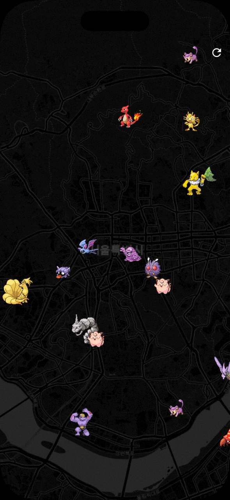

### App Session 7주차

> 담당 Core: 임도협

## 이번 주에는
- 커스텀 asset(이미지 등) 사용하기
- `flutter_map`([Package](https://pub.dev/packages/flutter_map))로 지도 띄우기
  - TileLayer와 MarkerLayer
- 지도에 포켓몬 랜덤하게 배치하기
- 지도 위 포켓몬을 탭해서 사냥하기

<br />



<br />

## 시작하기
```bash
git clone https://github.com/GDGoC-SeoulTech/5th_Flutter_Session_7
cd 5th_Flutter_Session_7/pokemon_map
code .
```

---


#### `lib/main.dart`
- Main 함수와 첫 홈화면 뷰를 가지고 있습니다!
  - `PokemonMap`은 `StatefulWidget`으로, 포켓몬들의 목록(`_pokemons`)을 state로 가지고 있고,
  - `initState`에서 `generateInitialPokemons`를 호출하여 지도에 처음 표시할 포켓몬들을 생성합니다.
  - `build` 메소드에서는 주 화면인 `PokemonMapView`를 렌더링하고, 포켓몬을 잡거나(`_onTapPokemon`) 리셋(`_resetPokemons`)하는 로직을 가지고 있습니다!

#### `lib/models.dart`
- `PokemonSpot` class로, 포켓몬 `id`, 그리고 지도에 표시하기 위한 위도(`lat`), 경도(`lon`)를 가지고 있습니다.
- 지도에 포켓몬 이미지를 표시하기 위해, `assetPath` getter를 통해 포켓몬 `id`에 해당하는 이미지 경로를 가져오고 있습니다!

#### `lib/utils.dart`
- `generateInitialPokemons`: 주어진 중앙 좌표 근처에 지정된 수만큼의 포켓몬을 랜덤하게 생성합니다!
- `spawnOnePokemon`: 매번 포켓몬을 잡을 때마다 호출되며, 새로운 포켓몬 한마리를 랜덤한 위치에 생성합니다!

#### `lib/widgets/map_view.dart`
- `FlutterMap` 위젯을 사용하여 지도를 표시합니다!
  - `TileLayer`: OpenStreetMap의 지도 타일을 불러와 배경으로 표시합니다. template URL을 변경해서 지도 스타일을 바꿀 수 있습니다! (**TODO #1**)
  - `MarkerLayer`: 포켓몬 마커들을 지도 위에 표시합니다. `pokemons` 리스트를 순회하며 각 포켓몬에 대해 `PokemonMarker` 위젯을 생성하고, 이를 `Marker` 객체로 변환하여 지도에 추가합니다! (**TODO #2**)

#### `lib/widgets/map_marker.dart`
- `toMarker()` 메소드를 통해 `flutter_map`이 사용할 수 있는 `Marker` 객체로 변환됩니다. 이때 `child: this`로 지정하여, 마커의 실제 표시 위젯으로 현재 `PokemonMarker` 인스턴스 자체를 사용하도록 합니다. 즉, `PokemonMarker` 위젯이 곧 지도 위에 그려지는 마커의 모습이 되며, 이를 통해 탭 이벤트나 이미지 렌더링 같은 UI 로직을 그대로 재사용할 수 있게 되는 것입니다!
- `GestureDetector`가 탭 이벤트를 감지하여 `onTap` 콜백을 호출합니다!
